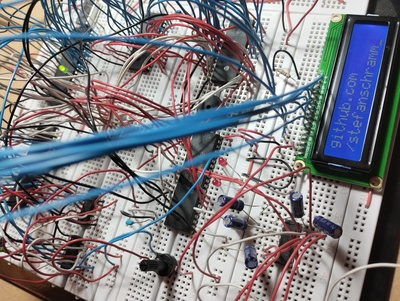
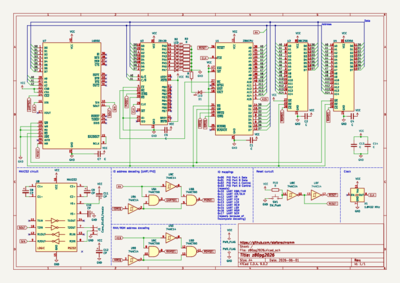

# z80pg2026

z80pg2026 is a Z80 based single board computer (SBC) on a breadboard.

 

## Hardware

[Schematics (PDF)](schematics/z80pg2026.pdf)

### Main components

- Z84C0006 - Z80 CPU (6 MHz max.)
- Z84C2006 - Z80 PIO
- 16C550 - UART controller
- 62C256 - 32 KByte SRAM
- AT28C64 - 8 KByte ROM
- MAX 232 - V.24 level converter
- 74HCT14 - hex Schmitt-Trigger inverter gate
- 74HCT00 - quad 2-input NAND gate
- 1.8432 MHz quarz oscillator

Plus some decoupling capacitors, resistors, reset button and LEDs.

### Memory mapping

| Address       | Mapping                      |
|---------------|------------------------------|
| 0x0000-0x1fff | ROM (monitor)                |
| 0x2000-0x7fff | ROM repeated; not to be used |
| 0x8000-0xffff | RAM                          |

### IO mapping

IO addresses are not fully decoded.
To keep the number of required ICs minimal, only A4 is used to differentiate between access to the PIO and UART.
Thus the ports reappear multiple times in the I/O address space.

| Address | Mapping            |
|---------|--------------------|
| 0x00    | PIO Port A Data    |
| 0x01    | PIO Port B Data    |
| 0x02    | PIO Port A Control |
| 0x03    | PIO Port B Control |
| ...     | (repeated)         |
| 0x10    | UART RBR/THR       |
| 0x11    | UART IER/DLM       |
| 0x12    | UART IIR           |
| 0x12    | UART FCR           |
| 0x13    | UART LCR           |
| 0x14    | UART MCR           |
| 0x15    | UART LSR           |
| 0x16    | UART MSR           |
| 0x17    | UART SCR           |
| ...     | (repeated)         |

### Possible modifications

- A HD44780 display has successfully been connected to the PIO.
- It should be possible to replace the MAX232 circuit with an FTDI USB-UART interface.

## Monitor software ("firmware")

The monitor is a simple menu system and is directly written assembler.
It is operated using a serial terminal.
Features include:

- writing/reading data to/from serial port
- execute code at specific memory location
- hexdump
- hex editor
- manually writing/reading data to/from I/O ports (IN/OUT instructions)
- some public routines (for input/output) for usage by other software - see [definitions.asm](src/include/definitions.asm)

### Usage

The menu appears after power-on/reset and should be self-explanatory.
Press `m` to re-display the menu.
The (single-character) commands are executed immediately and **don't** require confirmation using return.
Commands are case-sensitive.
Input of numbers is done in hexadecimal (in lowercase).
Most commands or input prompts can be canceled using `q`.

### Loading programs

The Bash script `load.sh` can be used to load programs using the serial port.
It automatically sends the `l` (load) command, the number of bytes to transfer, the destination address and (optionally) the `c` (call) command with the execution address.

### Memory layout

The stack pointer is initially set to 0xffff.

RST vector table is located beginning at 0xf800.
The monitor forwards RST instructions by jumping to these addresses.

### Development

#### Example programs

Examples can be found in [src/programs](src/programs).

They can be edited and assembled using `make programs`. The Makefile automatically causes the assembly of all `src/programs/*.asm` files into corresponding `build_programs/*.bin` files.

All examples are using 0xa000 as load address and entry address.
Loading and executing is done like this: `./load.sh build_programs/mcrtest.bin a000 a000`

#### Executing monitor from RAM

When changing the origin address of the monitor from 0x0000 to 0x8000 it can be loaded executed in RAM.

#### Code style

- lower case for everything except constants
- every label on its own line
- indentation of all instructions and most assembler directives using one tab
- no indentation of include directives
- one space bewtween instruction and its argument (no alignment)

## Authors

Stefan Schramm (<mail@stefanschramm.net>)

## License

[MIT](https://opensource.org/license/MIT)

Permission is hereby granted, free of charge, to any person obtaining a copy of this software and associated documentation files (the "Software"), to deal in the Software without restriction, including without limitation the rights to use, copy, modify, merge, publish, distribute, sublicense, and/or sell copies of the Software, and to permit persons to whom the Software is furnished to do so, subject to the following conditions:

The above copyright notice and this permission notice shall be included in all copies or substantial portions of the Software.

THE SOFTWARE IS PROVIDED "AS IS", WITHOUT WARRANTY OF ANY KIND, EXPRESS OR IMPLIED, INCLUDING BUT NOT LIMITED TO THE WARRANTIES OF MERCHANTABILITY, FITNESS FOR A PARTICULAR PURPOSE AND NONINFRINGEMENT. IN NO EVENT SHALL THE AUTHORS OR COPYRIGHT HOLDERS BE LIABLE FOR ANY CLAIM, DAMAGES OR OTHER LIABILITY, WHETHER IN AN ACTION OF CONTRACT, TORT OR OTHERWISE, ARISING FROM, OUT OF OR IN CONNECTION WITH THE SOFTWARE OR THE USE OR OTHER DEALINGS IN THE SOFTWARE.